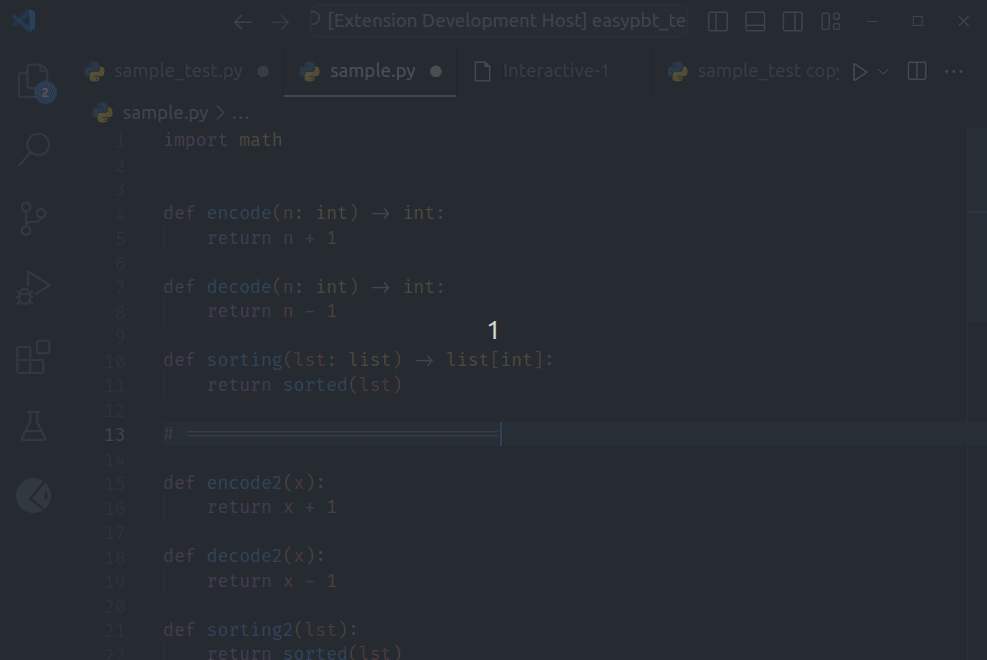
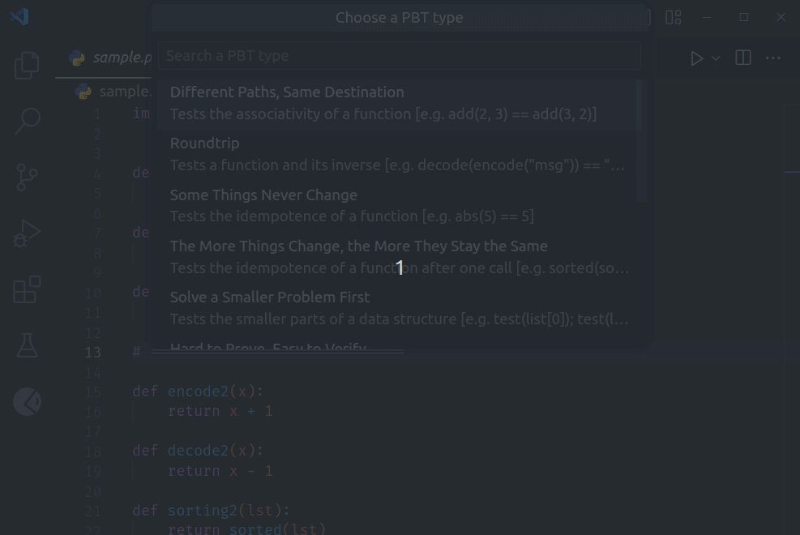
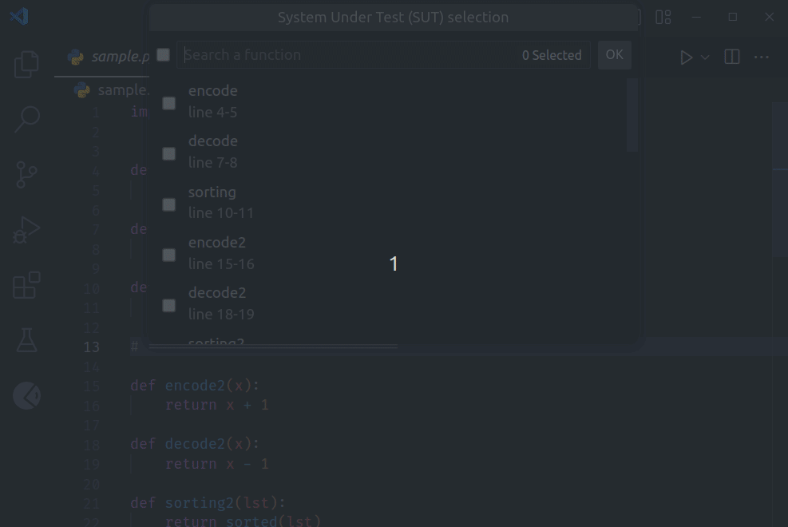
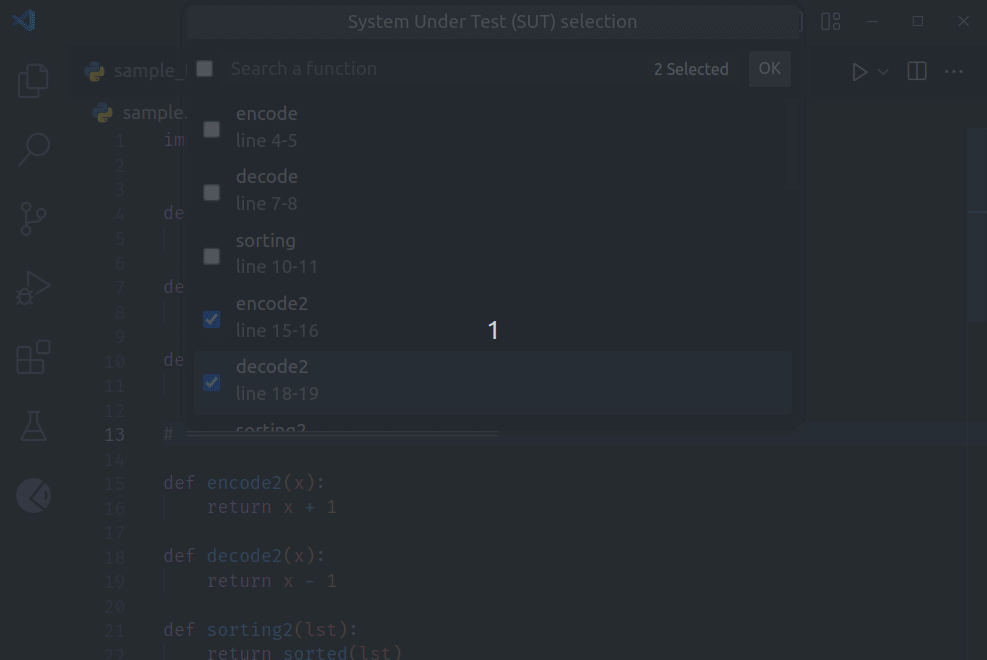
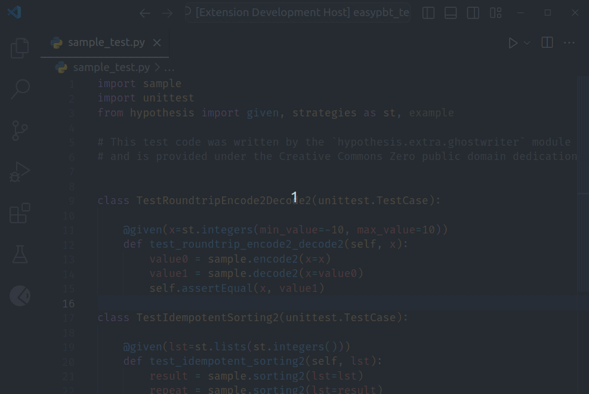

EasyPBT
=======


EasyPBT is a VSCode extension that facilitates the writing of property-based tests (PBT) using the Hypothesis Python library. 
It is based on [Microsoft's VSCode Python Tool Extension template](https://github.com/microsoft/vscode-python-tools-extension-template) that uses the [Language Server Protocol (LSP)](https://microsoft.github.io/language-server-protocol).

This project was developed as part of a bachelor thesis project at [Vrije Universiteit Brussel](https://www.vub.be/en).

The colors used in the icon of this extension is inspired by Hypothesis' and Python's logo. 


How to Use
----------
1. Execute the `EasyPBT: Generate PBT...` command. This can be done by opening the command prompt using Ctrl+Shift+P, or by assigning the command to a keystroke.

    

1. Select a PBT type from the list. For more information on the PBT types, please refer to [this blogpost](https://fsharpforfunandprofit.com/posts/property-based-testing-2/).

    

1. Select the function(s) to test. Depending on the chosen PBT type, one or two types must be selected.

    

1. Check the function parameters of the function to test for which you would want to write a separate generation strategy. This is recommended in case a parameter's type is a complex object.

    

1. (Optional) Add an explicit set of values to be generated on every test run by executing the `EasyPBT: Add explicit set of values to be generated`. This will add a `@example` decorator to the chosen function. 

    

----

Other Features
--------------
### Other commands
- The `EasyPBT: Generate PBT for selected function(s)` command works just like above, except that the function to test has to be selected in the editor.
- The `EasyPBT: Insert property template` command can be used to directly get a template for a type of property, in case one finds it easier.

### Test File Name Pattern
All tests will be put in a separate file with the following name pattern by default: `*_test.py`.
This can easily be changed in the setting with the following ID: `easypbt.testFileNamePattern`.


Requirements
------------

1. VS Code 1.64.0 or greater
1. Python 3.8 or greater
1. Python extension for VS Code (automatically installed when installing our extension)
1. The following pip packages:
    - hypothesis
    - black

To install these pip packages, execute this command on your terminal:
```bash
pip install hypothesis black
```

Contribution and Development Setup Instructions
-----------------------------------------------

### Setup

Before cloning the repository, make sure your computer has the following installed:
- VS Code 1.64.0 or greater
- Python 3.8 or greater
- node >= 18.17.0
- npm >= 8.19.0 (`npm` is installed with node, check npm version, use `npm install -g npm@8.3.0` to update)
- Python extension for VS Code
1. The following pip packages:
    - hypothesis
    - black
    - nox

To install these pip packages, execute this command on your terminal:
```bash
pip install hypothesis black nox
```

After cloning this repository, follow the steps below to setup the development environment:
1. Create a Python virtual environment `python -m venv .venv`
1. Activate the virtual environment:
    - Linux & MacOS: `source .venv/bin/activate`
    - Windows: `.venv/Scripts/Activate`
1. Install all python packages in the virtual environment: `pip install -r src/test/python_tests/requirements.txt`
1. Run the following command to setup nox: `nox --session setup`
1. Install all npm packages: `npm install`

### Debugging
To run for debugging, open the repo in a vscode window and press F5. This will open a new window with the experimental extension loaded. 
